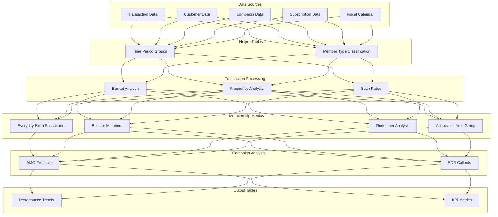
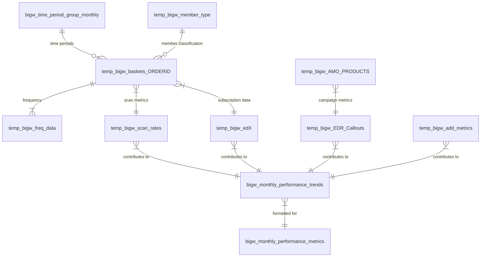
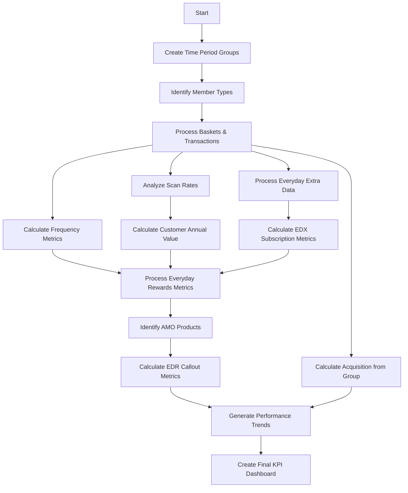
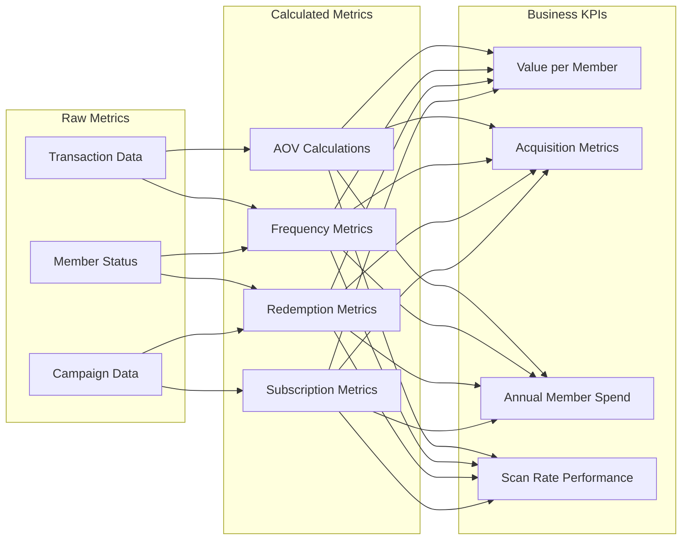

# BIGW Rewards Monthly KPI Dashboard - SQL Analysis

## Overview

This document analyzes the SQL code for BIGW's Everyday Rewards monthly KPI reporting system. The code creates a comprehensive monitoring framework tracking loyalty program performance, customer behavior, and business impact.

## Data Pipeline Architecture

## Database Schema Structure

## ETL Processing Flow

## Metrics Calculation Framework

## SQL Structure Analysis

The SQL script follows a logical progression:

1. **Helper Tables** - Creates fundamental reference tables:
   - `bigw_time_period_group_monthly`: Maps calendar dates to BIGW's fiscal periods
   - `temp_bigw_member_type`: Customer classification (Staff, EDR Subscriber, EDR Booster, EDR Member)

2. **Transaction Processing** - Processes basket-level data:
   - `temp_bigw_baskets_ORDERID`: Core transaction data for analysis
   - `temp_bigw_freq_data`: Frequency metrics for customer shopping patterns
   - `temp_bigw_scan_rates`: Loyalty card scan rates at different locations

3. **Subscription Analysis** - Analyzes Everyday Extra program:
   - `temp_bigw_edX`: Subscription metrics including sign-ups, AOV, and frequency

4. **Loyalty Program Analysis**:
   - `temp_bigw_AMO_PRODUCTS`: Analysis of Always-on Marketing Offers
   - `temp_bigw_EDR_Callouts`: Everyday Rewards program metrics
   - `temp_bigw_add_metrics`: Additional metrics including acquisition from group

5. **Final Outputs**:
   - `bigw_monthly_performance_trends`: Time series of all metrics
   - `bigw_monthly_performance_metrics`: Formatted dashboard metrics with MoM and YoY comparisons

## Key Business Metrics

1. **OKR Metrics:**
   - Value per member
   - Acquisition from Group
   - Annual Member Spend
   - Scan rate (Overall)
   - Active members (26 weeks)

2. **Everyday Rewards Metrics:**
   - Active member shopping behavior
   - Booster member metrics
   - AMO campaign performance
   - Redeemer analysis

3. **Everyday Extra (Subscription) Metrics:**
   - Subscriber counts
   - New sign-ups
   - Subscriber transaction value
   - Subscription frequency

4. **Additional Insights:**
   - Customer acquisition patterns
   - Category performance
   - Member pricing effectiveness
   - Loyalty program ROI 

   ---

