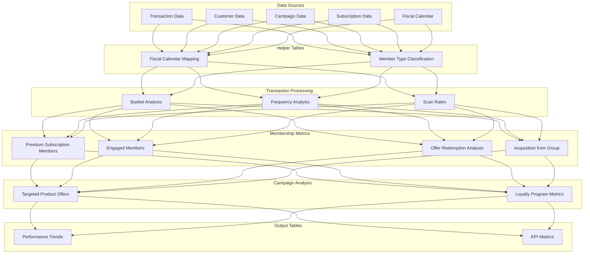
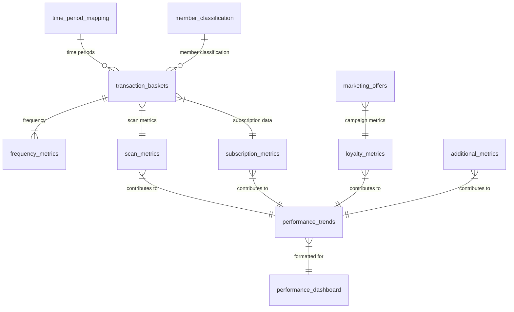
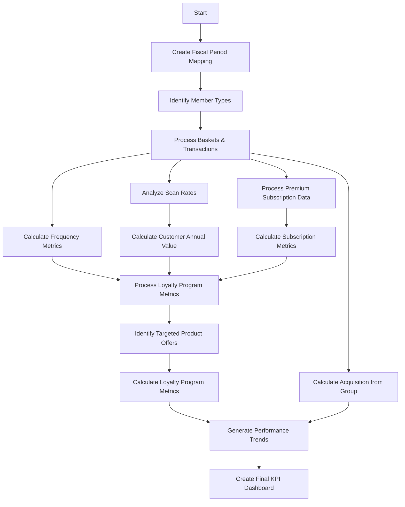
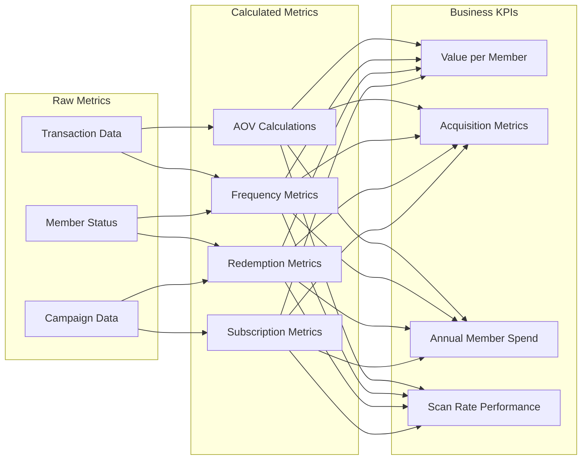

# Retail Loyalty Program Analytics Dashboard - Technical Architecture

## Overview

This document outlines the technical architecture for a comprehensive retail loyalty program analytics system. The solution provides detailed insights into customer behavior, program performance, and business impact through an integrated data pipeline and KPI framework.

## Data Pipeline Architecture

## Database Schema Structure

## ETL Processing Flow

## Metrics Calculation Framework

## SQL Structure Analysis

The SQL implementation follows a logical progression:

1. **Helper Tables** - Creates fundamental reference tables:
   - `time_period_mapping`: Maps calendar dates to fiscal periods
   - `member_classification`: Customer classification system (Premium, Engaged, Standard, etc.)

2. **Transaction Processing** - Processes basket-level data:
   - `transaction_baskets`: Core transaction data for analysis
   - `frequency_metrics`: Frequency metrics for customer shopping patterns
   - `scan_metrics`: Loyalty card scan rates at different locations

3. **Subscription Analysis** - Analyzes premium subscription program:
   - `subscription_metrics`: Subscription metrics including sign-ups, AOV, and frequency

4. **Loyalty Program Analysis**:
   - `marketing_offers`: Analysis of targeted product offers
   - `loyalty_metrics`: Loyalty program performance metrics
   - `additional_metrics`: Additional metrics including acquisition from group

5. **Final Outputs**:
   - `performance_trends`: Time series of all metrics
   - `performance_dashboard`: Formatted dashboard metrics with MoM and YoY comparisons

## Key Business Metrics

1. **OKR Metrics:**
   - Value per member
   - Acquisition from Group
   - Annual Member Spend
   - Scan rate (Overall)
   - Active members (26 weeks)

2. **Loyalty Program Metrics:**
   - Active member shopping behavior
   - Engaged member metrics
   - Marketing offer performance
   - Offer redemption analysis

3. **Premium Subscription Metrics:**
   - Subscriber counts
   - New sign-ups
   - Subscriber transaction value
   - Subscription frequency

4. **Additional Insights:**
   - Customer acquisition patterns
   - Category performance
   - Member offers effectiveness
   - Loyalty program ROI 

 ### Comprehensive Data Pipeline for BIGW

**Client:** BIGW Marketing Team  
**Focus:** ETL, Data Integration, Marketing Analytics, Business Intelligence

Developed a comprehensive data pipeline and analytics solution to integrate marketing campaign data, customer behavior, and sales performance across multiple business units, enabling data-driven decision making for marketing strategy.

**Project Highlights:**

- **Designed and implemented a sophisticated ETL pipeline integrating multiple data sources:**
    - Customer transaction data across 5 business destinations
    - Marketing campaign performance metrics (ATL/BTL)
    - Subscription program data (Everyday Extra)
    - Geographic market segmentation
    - Customer loyalty metrics
- **Created a unified data model that:**
    - Maps customer behavior across different geographic markets
    - Tracks campaign effectiveness by business unit
    - Monitors subscription program performance
    - Measures loyalty program engagement
- **Built a scalable analytics framework that:**
    - Processes over 170M customer transactions
    - Handles complex geographic segmentation (Metro/Regional markets)
    - Supports multiple business units (Clothing, Home Living, Toys & Leisure, etc.)
    - Enables granular analysis at store/postcode level
- **Delivered actionable insights:**
    - Identified key performance drivers by business unit
    - Tracked subscription program growth and impact
    - Measured campaign effectiveness across different market segments
    - Enabled data-driven marketing budget allocation

**Tools & Technologies:**  
SQL, Python (pandas, numpy), Tableau, Power BI, AWS