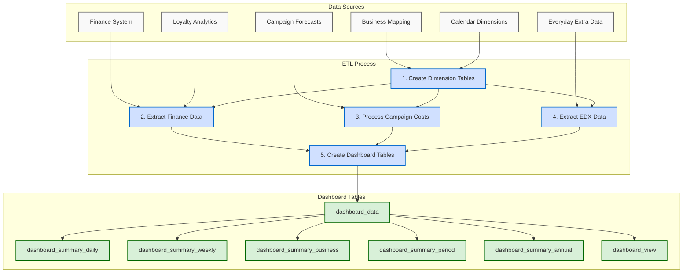

# Points Cost Forecast: High-Level Data Flow

## Key Components

### Data Sources
- **Finance System**: Financial actuals and forecasts
- **Loyalty Analytics**: Article-level sales data
- **Campaign Forecasts**: Campaign plans and budget allocations
- **Everyday Extra Data**: EDX offer details and rewards
- **Business Mapping**: Business/category hierarchies
- **Calendar Dimensions**: Fiscal mapping and date dimensions

### ETL Process
1. **Create Dimension Tables**: Establish reference tables for time, business categorization, and weighting factors
2. **Extract Finance Data**: Process actual and forecasted financials with business/category mapping
3. **Process Campaign Costs**: Calculate campaign cost distributions and forecasts
4. **Extract EDX Data**: Process Everyday Extra loyalty program costs
5. **Create Dashboard Tables**: Combine all metrics into unified dashboard views

### Dashboard Tables
- **dashboard_data**: Complete dataset with detailed metrics
- **dashboard_summary_daily**: Daily aggregation of costs and sales
- **dashboard_summary_weekly**: Weekly aggregation for trend analysis
- **dashboard_summary_business**: Business-level performance view
- **dashboard_summary_period**: Monthly and quarterly aggregations
- **dashboard_summary_annual**: Annual summary across fiscal years
- **dashboard_view**: Comprehensive view for dashboard users
