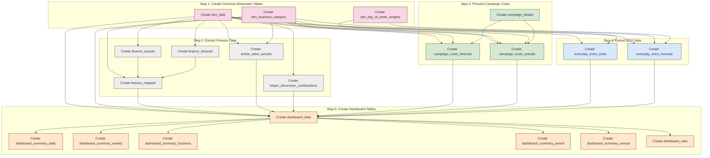

# Points Cost Forecast: SQL Execution Flow

## SQL Execution Flow Explained

The Points Cost Forecast SQL process follows a structured flow designed to transform raw data into actionable insights:

### Step 1: Create Common Dimension Tables
- **dim_date**: Builds the calendar framework including fiscal periods
- **dim_business_category**: Establishes the business hierarchy mapping
- **dim_day_of_week_weights**: Creates distribution weights for daily allocations

### Step 2: Extract Finance Data
- **finance_actuals**: Extracts actual financial data from the finance system
- **finance_forecast**: Extracts financial forecasts for future periods
- **finance_mapped**: Maps finance data to business/category dimensions
- **article_sales_actuals**: Processes granular article-level sales
- **helper_dimension_combinations**: Creates complete time/business matrix

### Step 3: Process Campaign Costs
- **campaign_details**: Extracts campaign metadata and forecasts
- **campaign_costs_forecast**: Calculates campaign forecasts by business/category
- **campaign_costs_actuals**: Distributes campaign costs to daily granularity

### Step 4: Extract EDX Data
- **everyday_extra_costs**: Processes actual Everyday Extra costs
- **everyday_extra_forecast**: Generates forecasts for EDX program

### Step 5: Create Dashboard Tables
- **dashboard_data**: Combines all metrics into a unified dataset
- **dashboard_summary_***: Creates aggregated views at various levels
- **dashboard_view**: Exposes the data for dashboard consumption

The arrows in the diagram show key dependencies between tables, highlighting which tables must be created before others.
