# Points Cost Forecast: Technical Table Relationships

```mermaid
graph TD
    subgraph "Source Systems"
        S1["Finance System<br/><i>fin_bigw_profit_v</i>"]
        S2["Loyalty Analytics<br/><i>bi_article_sales_bigw</i>"]
        S3["EDX<br/><i>EDX_offer_details</i>"]
        S4["Business Mapping<br/><i>BigW_Destination_Business</i>"]
        S5["Campaign Details<br/><i>bigw_campaign_details_planOnPage_FY25</i>"]
        S6["Calendar Dimensions<br/><i>dim_date_v</i>"]
    end

    subgraph "Dimension Tables"
        D1["dim_date<br/><small>JOIN key: CalendarDay</small>"]
        D2["dim_business_category<br/><small>JOIN key: SubCategory</small>"]
        D3["dim_day_of_week_weights<br/><small>JOIN key: DayOfWeek</small>"]
    end

    subgraph "Finance Layer"
        F1["finance_actuals<br/><small>GROUP BY: FiscalYear, FiscalWeekYear, FiscalWeek, Business, Category</small>"]
        F2["finance_forecast<br/><small>GROUP BY: FiscalYear, FiscalWeekYear, FiscalWeek, Category_Description</small>"]
        F3["finance_mapped<br/><small>UNION of actuals and forecasts</small>"]
        F4["article_sales_actuals<br/><small>JOIN Article Description to Business</small>"]
    end

    subgraph "Campaign Layer"
        C1["campaign_details<br/><small>Each row is a campaign stream</small>"]
        C2["campaign_costs_forecast<br/><small>Uses basis points (50bps, 70bps) for costs</small>"]
        C3["campaign_costs_actuals<br/><small>Distributes to daily using weights</small>"]
    end

    subgraph "Everyday Extra Layer"
        E1["everyday_extra_costs<br/><small>JOIN to transactions and basket details</small>"]
        E2["everyday_extra_forecast<br/><small>Forecasts based on historical patterns</small>"]
    end

    subgraph "Dashboard Layer"
        DD1["dashboard_data<br/><small>Full JOIN of all metrics</small>"]
        DD2["dashboard_summary_daily<br/><small>GROUP BY: FiscalYear, FiscalWeekYear, FiscalWeek, CalendarDay</small>"]
        DD3["dashboard_summary_weekly<br/><small>GROUP BY: FiscalYear, FiscalWeekYear, FiscalWeek</small>"]
        DD4["dashboard_summary_business<br/><small>GROUP BY: FiscalYear, FiscalWeekYear, FiscalWeek, Business</small>"]
        DD5["dashboard_summary_period<br/><small>GROUP BY: FiscalYear, Fiscal_Period</small>"]
        DD6["dashboard_summary_annual<br/><small>GROUP BY: FiscalYear</small>"]
        DD7["dashboard_view<br/><small>View for final consumption</small>"]
    end

    %% Source to Dimension connections
    S6 --> D1
    S4 --> D2
    S6 --> D3

    %% Dimension to Finance connections
    D1 --> F1
    D1 --> F2
    D1 --> F4
    D2 --> F3
    D2 --> F4

    %% Finance connections
    F1 --> F3
    F2 --> F3

    %% Dimension to Campaign connections
    D1 --> C2
    D1 --> C3
    D2 --> C2
    D2 --> C3
    D3 --> C3

    %% Campaign connections
    C1 --> C2
    C1 --> C3

    %% Dimension to EDX connections
    D1 --> E1
    D1 --> E2
    D2 --> E1
    D2 --> E2
    D3 --> E2

    %% Finance to Dashboard
    F3 --> DD1
    F4 -.-> DD1

    %% Campaign to Dashboard
    C2 --> DD1
    C3 --> DD1

    %% EDX to Dashboard
    E1 --> DD1
    E2 --> DD1

    %% Dashboard connections
    DD1 --> DD2
    DD1 --> DD3
    DD1 --> DD4
    DD1 --> DD5
    DD1 --> DD6
    DD1 --> DD7

    class S1,S2,S3,S4,S5,S6 sourceStyle
    class D1,D2,D3 dimensionStyle
    class F1,F2,F3,F4 financeStyle
    class C1,C2,C3 campaignStyle
    class E1,E2 edxStyle
    class DD1,DD2,DD3,DD4,DD5,DD6,DD7 dashboardStyle

    classDef sourceStyle fill:#f9f9f9,stroke:#666,stroke-width:1px,color:#333
    classDef dimensionStyle fill:#e6f2ff,stroke:#0066cc,stroke-width:1px,color:#0066cc
    classDef financeStyle fill:#e6ffe6,stroke:#009900,stroke-width:1px,color:#006600
    classDef campaignStyle fill:#fff2e6,stroke:#ff8000,stroke-width:1px,color:#cc5200
    classDef edxStyle fill:#f9e6ff,stroke:#8000ff,stroke-width:1px,color:#6600cc
    classDef dashboardStyle fill:#ffe6e6,stroke:#ff0000,stroke-width:1px,color:#cc0000
```



## Technical Table Relationship Details

This diagram provides developers with specific technical details about the table relationships, including:

### Primary Join Keys
- **dim_date**: Joined on CalendarDay for temporal relationships
- **dim_business_category**: Joined on SubCategory to map to business hierarchies
- **dim_day_of_week_weights**: Distributes costs by DayOfWeek

### Key Technical Details

#### Finance Layer
- **finance_actuals**: Leverages `fp.MerchandiseManager_Department` for Business mapping
- **finance_forecast**: Uses Value_Type_Description = 'Budget' to identify forecasts
- **finance_mapped**: Uses UNION ALL to combine actuals and forecasts with a DataType flag
- **article_sales_actuals**: Joins `CategoryDescription` for granular mapping

#### Campaign Layer
- **campaign_details**: Each row represents a unique campaign stream with budget
- **campaign_costs_forecast**: Applies basis point calculations (50bps for FY25, 70bps for others)
- **campaign_costs_actuals**: Uses day-of-week weights to distribute weekly costs to days

#### Everyday Extra Layer
- **everyday_extra_costs**: Joins transactions to baskets for category distribution
- **everyday_extra_forecast**: Uses historical patterns with growth factors

#### Dashboard Layer
- **dashboard_data**: Uses FULL OUTER JOIN to combine all metrics
- **dashboard_summary_tables**: GROUP BY at different levels of granularity
- **dashboard_view**: View for final consumption by dashboard tool

### SQL Join Logic

```sql
-- Example of key join logic in finance_mapped
LEFT JOIN `gcp-wow-rwds-ai-pobe-dev.points_cost_forecast.dim_business_category` bc
    ON UPPER(bc.SubCategory) = UPPER(fa.Category_Description_profit_v)

-- Example of campaign cost forecast calculation
cd.costs_budget_fcast * 0.0050 AS cost_50bps_forecast

-- Example of EDX distribution 
eb.reward_value * SAFE_DIVIDE(bs.total_sales, SUM(bs.total_sales) OVER (PARTITION BY bs.Basket_OrderID)) AS reward_value_distrib
```
