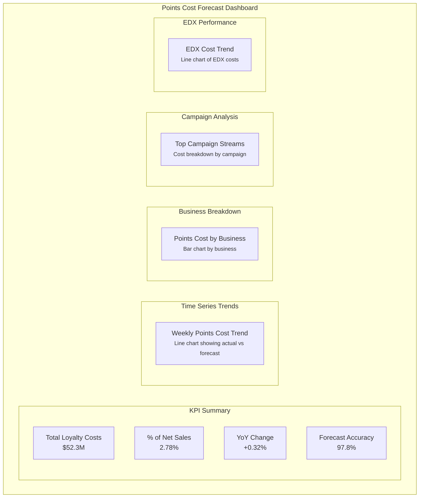
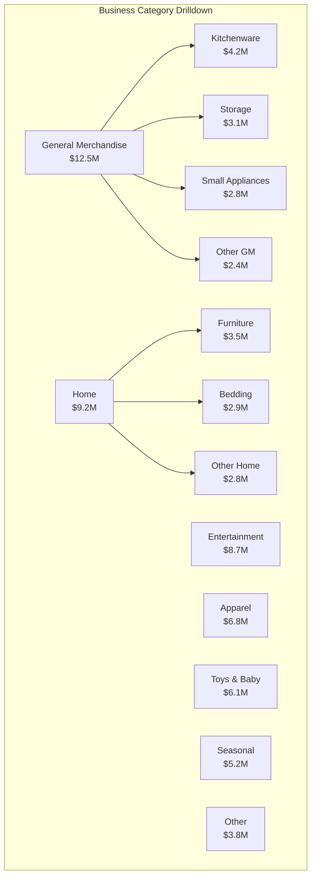

# Points Cost Forecast: Dashboard Visualization Mockup

## Executive Dashboard

## Weekly View Dashboard

## Business Category View

The dashboard provides drill-down capabilities from Business to Category level:

## Campaign Analysis View

Campaign Stream analysis provides detailed performance metrics:

| Campaign Stream | Budget Forecast | 50bps Forecast | Actual Cost | Variance | 
|----------------|----------------|----------------|-------------|----------|
| Homewares | $24.8M | $1.24M | $1.21M | -2.4% |
| Back to School | $18.2M | $0.91M | $0.95M | +4.4% |
| Toy Sale | $32.5M | $1.63M | $1.72M | +5.5% |
| Electronics | $15.6M | $0.78M | $0.74M | -5.1% |
| Seasonal | $21.9M | $1.10M | $1.08M | -1.8% |

## Dashboard Filters

The dashboard supports multiple filters to analyze data:

- **Date Range**: Select custom date ranges or preset periods (This Year, Last Year, YTD)
- **Fiscal Hierarchy**: Filter by Fiscal Year, Period, or Week
- **Business Hierarchy**: Filter by Business, Category, or Subcategory
- **Campaign Stream**: Filter by specific marketing campaigns
- **Data Type**: Toggle between Actual, Forecast, or Combined view

## Time Series Comparison

## Key Metrics Explained

1. **Total Loyalty Costs**: Sum of all loyalty program costs:
   - Campaign Costs (50bps/70bps of sales)
   - Scanback Costs
   - EDX 10% Program Costs

2. **Loyalty Costs % of Sales**: Total loyalty costs divided by net sales

3. **Forecast vs Actual Variance**: Difference between forecasted and actual costs
   - Positive: Actual costs higher than forecast
   - Negative: Actual costs lower than forecast

4. **YoY Comparison**: Current year vs. previous year comparison
   - Absolute change in dollars
   - Percentage change in loyalty costs % of sales

## Dashboard Navigation Guide

1. Start at the **Executive Summary** for high-level KPIs
2. Explore the **Time Series Trends** to identify patterns
3. Use the **Business Breakdown** to drill into specific business areas
4. Analyze **Campaign Performance** to evaluate marketing effectiveness
5. Review **EDX Performance** to understand subscription program costs
6. Apply **Filters** to focus on areas of interest
7. Export data using the dashboard **Download** options
