# Portfolio Website Ecosystem Diagram

```mermaid
graph TD
    %% Main Components
    A[Main Portfolio Website\nFlask Application] --> B[Static Content]
    A --> C[Dynamic Content]
    
    %% Integration with SuiteCRM
    M[SuiteCRM Integration] -.-> |Future/Planned|A
    M --> N[(SuiteCRM Database\nMySQL)]
    M --- O[SuiteCRM API\nPHP/REST]
    
    %% Database
    D[(Database)] -.-> |Not currently used|A
    D -.-> |Potential future use for\nblog/contact submissions|A
    
    %% External APIs
    A --> E[GitHub API Integration]
    A --> F[Tableau Public API Integration]
    
    %% Analytics & Tracking
    A --> G[Google Tag Manager Integration]
    G --> H[Google Analytics 4]
    
    %% User Types
    I[Web Users] --> A
    I1[Admin Users] -.-> M
    I2[End Users] --> A
    
    %% Static Asset Storage
    P[Static Asset Storage] --> A
    P -.-> |Potential future implementation|Q[AWS S3 or similar]
    
    %% Content Management
    J[Content Management] --> A
    
    %% Communication Channels
    R[Email Notifications] -.-> |Future/Planned|A
    R -.-> S[Email Service\nSendGrid/AWS SES]
    
    %% API Flows
    E --> K[GitHub Repositories]
    F --> L[Tableau Public Dashboards]
    
    %% Static Content Details
    B --> B1[HTML Templates\nJinja2]
    B --> B2[CSS Styles\nBootstrap 5]
    B --> B3[JavaScript\nInteractive Elements]
    B --> B4[Static Assets\nImages, Files]
    
    %% Dynamic Content Details
    C --> C1[Projects Display]
    C --> C2[Skills Visualization]
    C --> C3[Experience Timeline]
    C --> C4[Architecture Diagrams]
    C --> C5[Contact Form]
    
    %% Analytics Details
    G --> G1[Event Tracking\nUser Interactions]
    G --> G2[DataLayer Implementation]
    G --> G3[Custom Events]
    
    %% GitHub Integration Details
    E --> E1[Repository List]
    E --> E2[Repo Metadata]
    E --> E3[Languages & Stats]
    
    %% Tableau Integration Details
    F --> F1[Embedded Dashboards]
    F --> F2[Visualization Metadata]
    
    %% DevOps
    T[CI/CD Pipeline] -.-> |Future/Planned|A
    T -.-> U[Deployment\nPlatform]
    
    %% Style definitions
    classDef mainComponent fill:#bbdefb,stroke:#1976d2,stroke-width:2px
    classDef database fill:#c8e6c9,stroke:#388e3c,stroke-width:2px
    classDef api fill:#ffecb3,stroke:#ffa000,stroke-width:2px
    classDef analytics fill:#e1bee7,stroke:#8e24aa,stroke-width:2px
    classDef user fill:#d1c4e9,stroke:#5e35b1,stroke-width:2px
    classDef content fill:#fff9c4,stroke:#fbc02d,stroke-width:2px
    classDef staticContent fill:#b3e5fc,stroke:#0288d1,stroke-width:1px
    classDef dynamicContent fill:#ffccbc,stroke:#e64a19,stroke-width:1px
    classDef future fill:#f5f5f5,stroke:#757575,stroke-width:1px,stroke-dasharray: 5 5
    classDef crm fill:#ffcdd2,stroke:#d32f2f,stroke-width:2px
    
    %% Apply styles
    class A,B,C mainComponent
    class D,N database
    class E,F,K,L,O api
    class G,H,G1,G2,G3 analytics
    class I,I1,I2 user
    class J content
    class B1,B2,B3,B4 staticContent
    class C1,C2,C3,C4,C5,E1,E2,E3,F1,F2 dynamicContent
    class P,Q,R,S,T,U future
    class M,N,O crm
```

## Ecosystem Components Description

### Core Application
- **Main Portfolio Website (Flask)**: The central component built with Flask that serves the entire website
- **Static Content**: HTML templates, CSS styles, JavaScript files, and other static assets
- **Dynamic Content**: Content generated or fetched dynamically, like projects, GitHub repos, or Tableau visualizations

### SuiteCRM Integration (Future/Planned)
- **SuiteCRM API**: PHP/REST API that interfaces with SuiteCRM
- **SuiteCRM Database**: MySQL database used by SuiteCRM for content and user management

### Database
- Currently not implemented/used in the application
- Potential future use for features like blog posts or contact form submissions

### External APIs
- **GitHub API**: Fetches repository data from the user's GitHub account
- **Tableau Public API**: Embeds Tableau Public visualizations into the website

### Analytics & Tracking
- **Google Tag Manager**: Container for all tracking scripts and configurations
- **Google Analytics 4**: Analytics platform for tracking user interactions and engagement
- **Custom Event Tracking**: Tracks specific user interactions like scroll depth, time on page, etc.

### User Types
- **Web Users**: General website visitors accessing various sections
- **Admin Users**: Administrators with access to CRM and content management (future)
- **End Users**: Regular users consuming content

### Static Asset Storage
- Currently using local file storage
- Potential future implementation on AWS S3 or similar cloud storage

### Communication Channels (Future/Planned)
- **Email Notifications**: For contact form submissions and alerts
- **Email Service**: SendGrid or AWS SES for reliable email delivery

### Content Management
- Handled directly through code updates (no CMS currently implemented)

### DevOps (Future/Planned)
- **CI/CD Pipeline**: For automated testing and deployment
- **Deployment Platform**: For hosting the application
