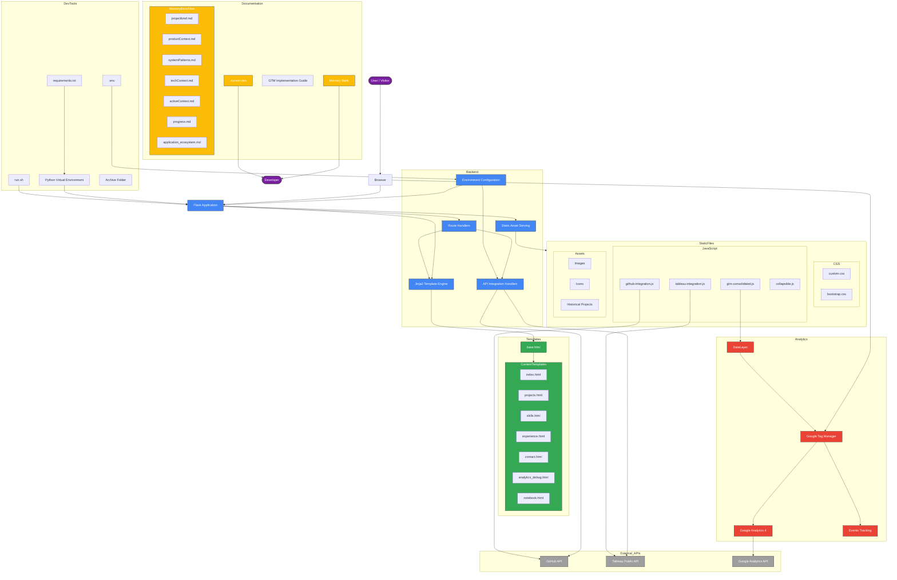

# Professional Portfolio v4 - Application Ecosystem

The following diagram provides a comprehensive view of the Professional Portfolio v4 application ecosystem, showing the relationships between components, data flow, and interactions.

## Key Component Relationships

1. **User Interaction Flow**:
   - Users access the Flask application through their browser
   - Flask routes handle requests and serve appropriate content
   - Templates are rendered with dynamic content
   - Static assets enhance the user experience

2. **Data Flow**:
   - External APIs provide dynamic content (GitHub repositories, Tableau visualizations)
   - Environment variables configure API connections
   - API handlers transform external data for template rendering

3. **Analytics Flow**:
   - The DataLayer collects and organizes user interaction data
   - Google Tag Manager processes and routes tracking data
   - Google Analytics 4 stores and analyzes the data
   - Event tracking captures specific user interactions

4. **Documentation System**:
   - Memory Bank provides comprehensive project documentation
   - .cursorrules captures project-specific patterns and rules
   - GTM Implementation Guide documents analytics configuration

5. **Development Tools**:
   - Python virtual environment isolates dependencies
   - run.sh script provides easy application startup
   - requirements.txt manages dependencies
   - .env file configures environment variables
   - Archive folder stores legacy files

This ecosystem diagram illustrates the comprehensive architecture of the Professional Portfolio v4 application, showing how all components interact to create a cohesive and functional system. 