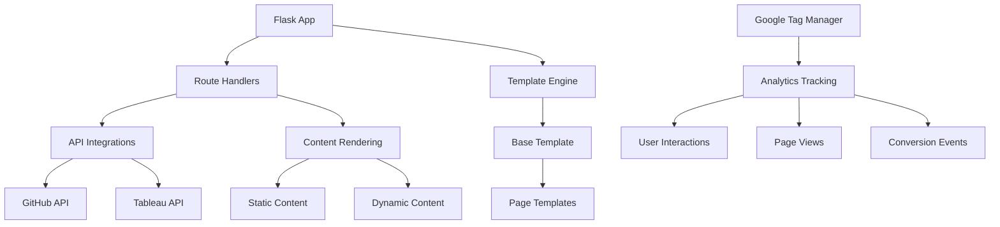

# System Patterns - Professional Portfolio v4

## System Architecture
The Professional Portfolio v4 is built on a Flask-based web application architecture with the following components:

1. **Backend Framework**: Flask provides the core server functionality, routing, and template rendering
2. **Template Engine**: Jinja2 (integrated with Flask) handles HTML templating and content injection
3. **Frontend Framework**: Bootstrap 5 with custom dark theme provides responsive UI components
4. **Data Integrations**: API connections to GitHub and Tableau Public for dynamic content
5. **Analytics**: Google Tag Manager with GA4 for comprehensive user tracking
6. **Documentation**: Memory Bank system for maintaining project context

## Key Technical Decisions

### Flask Framework Selection
Flask was chosen for its lightweight nature and flexibility, allowing for:
- Simple route definitions with clear mappings to HTML templates
- Easy integration with external APIs
- Minimal overhead for a primarily static site with some dynamic elements
- Python-based backend to match the data analysis focus of the portfolio

### Templating Structure
The application uses template inheritance to maintain consistency:
- `base.html` provides the core layout, navigation, and footer
- Content pages (home, projects, skills, etc.) extend the base template
- Common UI components are reused across pages

### API Integration Strategy
External APIs are integrated using a consistent pattern:
- Server-side API calls to fetch data (GitHub repositories, Tableau views)
- JSON responses transformed into structured data objects
- Data passed to templates or returned as JSON for client-side rendering
- Environment variables used for sensitive API tokens

### Analytics Implementation
A comprehensive analytics tracking system was implemented:
- Google Tag Manager as the container for all tracking
- Google Analytics 4 for data collection and reporting
- Custom DataLayer implementation for enhanced tracking
- Consolidated JavaScript file for all GTM and GA4 configuration
- Event-based tracking for user interactions

## Design Patterns in Use

1. **MVC (Model-View-Controller)**
   - Models: Simple Python data structures for API responses
   - Views: Jinja2 templates for rendering
   - Controllers: Flask routes handling requests and responses

2. **Template Method Pattern**
   - Base template defines the skeleton of the page
   - Child templates implement specific content sections

3. **Factory Pattern**
   - API handlers create appropriate data objects from external sources

4. **Observer Pattern**
   - Analytics tracking observes user behaviors without affecting core functionality
   - Event listeners track interactions for data collection

5. **Proxy Pattern**
   - Server acts as a proxy for external APIs, adding authentication and data transformation

## Component Relationships

The system maintains a clear separation of concerns while allowing for flexibility in content presentation and data integration. The architecture prioritizes maintainability, performance, and user experience. 